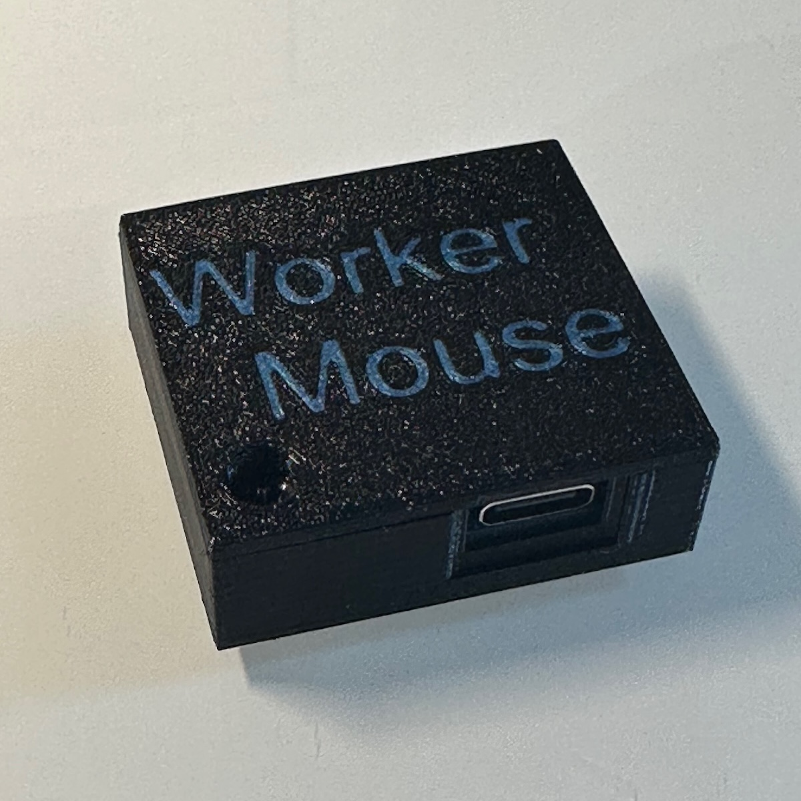

# WorkerMouse

An AVR project for a simple DIY mouse jiggler, using a minimal number of parts and simple software.

 
 

This project uses [V-USB](https://www.obdev.at/products/vusb/index.html), for a firmware-only USB driver. This USB device is also registered - via [pid.codes](https://pid.codes/) - [VID 1209, PID F480](https://pid.codes/1209/F480/).

 
 

## Site Index

- [3D Models](./models.md)
- [Schematics](./schema.md)
- [Media](./media.md)
- [Parts Info](./parts.md)
- [Source Code](https://github.com/zbauman3/WorkerMouse)